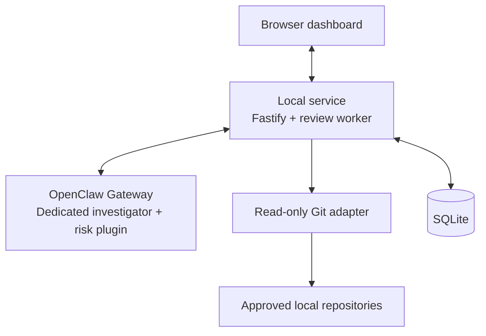

# Development Risk Agent

## Problem and scope

Blockers, at-risk work, and dependencies can be missed when one developer works across tasks and repositories.
The application keeps the plan and evidence together, then lets an optional investigator choose useful follow-up reads and explain what needs attention.
A commit or agent report is evidence, not proof that a task is complete.

The MVP includes SQLite persistence, bounded read-only Git discovery and capture, an OpenClaw adapter and tool plugin, an authenticated local HTTP API, and a browser dashboard.
It supports one local developer and one active investigation at a time.
It does not edit or execute monitored code, fetch remotes, automatically complete tasks, or manage tickets and remote workers.

The following remain evaluation targets, not measured product claims:

- Find more real blockers than fixed rules or a single AI summary without more false alarms in human-reviewed cases.
- Serve planning and status requests within 200 ms at p50 and 1 s at p99; show accepted findings within 2 s at p99.
- Preserve saved work across failures and retries without duplicate accepted results, out-of-scope disclosure, or writes to monitored repositories.
- Report available usage and cost, retaining unknown values and unresolved reservations explicitly.

## Architecture

The local service owns plans, repository approvals, queued work, evidence, and accepted findings.
OpenClaw supplies model sessions and tool execution; provider behavior stays behind an adapter.
Git and provider calls happen outside write transactions.
The core depends on ports so domain behavior can also be tested with deterministic clocks, in-memory stores, and scripted runtimes.

The service binds to IPv4 loopback and requires a local-user bearer credential for application endpoints.
A one-use browser link exchanges its URL fragment for a 12-hour session credential retained in tab-scoped session storage, allowing reloads without signing in again.
The four investigator endpoints require a separate attempt credential; it cannot read dashboard endpoints or full local receipts.
Expired sessions, service restarts, and new tabs can get a fresh link through `pnpm dashboard` without restarting the service.
That command reads the existing private owner credential and calls an owner-only same-origin endpoint; browser and attempt credentials cannot mint new links.
Malformed or expired tab data is discarded, failed authentication clears it, and blocked browser storage falls back to the current page's in-memory session. No permanent bearer is stored in a URL or browser storage.

## Planning and repository scope

There is no project entity or implicit repository grouping.
A sprint holds its window, optional goal, assumptions, and review cadence.
Tasks hold points, criteria, optional descriptions and dates, and prerequisite IDs; dependencies can cross sprints.
Task dates default to the sprint window, each end date must follow its start date, and dependency cycles or missing prerequisites are rejected.
Dates are stored in UTC and displayed in the device's local time zone.
Versioned task edits reject stale updates.

Starting an active sprint closes the previous active sprint.
Earlier unfinished work stays visible, while completed tasks from ended sprints appear in Archive.
Only explicit user actions complete or reopen tasks.
Risk state is separate from task state, and points are never converted into estimated hours.

Repositories are independently registered and can support tasks in any sprint.
Approving a folder permits bounded discovery and local metadata capture; it does not select repositories for every future investigation.
The dashboard's repository checkboxes start unchecked.
Each queued request retains a sorted explicit repository allowlist, and an empty list means plan-only.
Dependencies, evidence filters, and later discovery do not widen that scope.

## Read-only evidence capture

Discovery scans only explicitly approved roots, skips excluded directories and directory symlinks, and reports incomplete results when entry, depth, repository, or time bounds stop the scan.
Repository identity includes canonical filesystem and Git administration identities; replacing a registered path stops capture until it is registered again.
Linked worktrees require approval that includes their shared Git administration directory.

The Git adapter uses allowlisted commands with bounded output and deadlines.
It disables hooks, fsmonitor, prompts, optional writes, and lazy fetching, and rejects executable filters, configuration includes, object alternates, administrative symlinks, and unsupported metadata layouts.
Administrative tree inspection is also bounded.
It checks identity around capture and records HEAD, branch, status, and dirty-path metadata fingerprints without collecting source text.
These are application access checks, not a claim of OS sandbox isolation or protection against every concurrent filesystem race.

Evidence is saved before use and retains its source, time, digest, locator, and top-level repository origin where applicable.
Optional sprint or task context does not replace repository provenance.
Evidence and selected content are treated as untrusted observations, not instructions.
Missing or conflicting observations remain visible rather than implying success.

**Capture metadata** refreshes local observations and acknowledges the capture without requesting an investigation.
Local capture retires the previous observation's pending review handoff before refreshing; a failed refresh keeps earlier evidence and queued reviews, but does not restore that handoff.
**Review now** queues a review of saved evidence using the selected scope.
**Resync** first captures the selected repositories, then queues a manual review even if the metadata did not change.
Neither action fetches or modifies repository files.
There is no automatic Git watcher or automatic task-to-repository matching in the MVP.

## Review admission and execution

| Entry point                        | Behavior                                                                                                                |
| ---------------------------------- | ----------------------------------------------------------------------------------------------------------------------- |
| Plan change                        | With investigations enabled, save the mutation and a review request atomically using its explicit repository selection. |
| Manual review or resync            | Queue a request with a caller-generated ID, so an equivalent retry reuses the saved request.                            |
| Task deadline                      | Request a review when unfinished work reaches its end date.                                                             |
| Sprint cadence                     | Request a review after the configured interval, measured from sprint start or the last review.                          |
| Explicit stored-trigger evaluation | Evaluate newly captured Git observations and due work within the caller's supplied repository scope.                    |

Investigations are disabled unless a runtime is explicitly configured.
When enabled, the local worker wakes every 30 seconds and after relevant API actions.
Periodic evaluation is plan-only; queued requests keep their own immutable repository scope.
Each turn drains at most ten saved dispatches, with one active investigation for the installation.
The application does not configure OpenClaw cron jobs.

Admission stores immutable trigger facts and a deduplication key; dispatch records track leases, delivery, and retry eligibility.
The service reserves token capacity before starting an attempt, counting reported usage from the last 24 hours and unresolved reservations regardless of age.
Queue and token limits reject additional work rather than silently bypassing admission.
Cancelled or timed-out work can retain reservations when final usage is unknown.
This accounting cannot impose a hard spending cap on a remote provider.

Attempts retain an ownership version, expiry, planning digest including prerequisites, repository allowlist, and credential hash.
A separate private credential file makes the opaque token available only to the managed OpenClaw session; it is not put in the model prompt.
Twelve authenticated context/evidence reads are allowed per attempt, including reads that fail after authentication.
The service rechecks authority after external capture and before accepting results.
Cancellation and lease expiry reject late reads or submissions; they do not prove remote work stopped.

## OpenClaw integration

[The setup guide](openclaw.md) describes the pinned runtime, dedicated investigator, built plugin, and manual configuration.
The adapter creates a fresh managed session and verifies that its effective tool inventory contains exactly these four tools before starting a turn:

| Tool                 | Purpose                                                                                   |
| -------------------- | ----------------------------------------------------------------------------------------- |
| `risk_get_context`   | Read bounded plan, prerequisite, evidence, prior finding, and feedback context.           |
| `risk_list_evidence` | List recent saved evidence within the attempt's scope, optionally filtered by repository. |
| `risk_get_evidence`  | Read specific stored records, including older citations.                                  |
| `risk_inspect_git`   | Capture approved Git metadata and return saved evidence after rechecking authority.       |

The model chooses which permitted evidence to read and returns one structured answer with findings, uncertainty, citations, next checks, and optionally a question.
It cannot edit the plan or declare a task complete.
Plugin hooks restrict tools to the managed session and allow one final-answer format correction within the existing attempt limits.
API authorization and atomic acceptance remain definitive.

The adapter invokes the Gateway explicitly instead of allowing an embedded-runtime fallback with a different tool policy.
CLI output and HTTP responses are bounded, credentials expire, and local credential files are removed when an attempt ends.
Cancellation kills local CLI waiting and requests a best-effort Gateway abort.
Only available telemetry is recorded; missing counters and cost remain unknown.

## Persistence and accepted findings

SQLite stores plans, repository observations, evidence, triggers, dispatches, attempts, accepted receipts, findings, citations, feedback, and risk projections.
The adapter applies checksummed migrations, foreign-key constraints, WAL mode, a five-second busy timeout, and serialized short `BEGIN IMMEDIATE` transactions.
Admission reads and writes share the same transaction, and a failed write rolls back the whole operation.
The state directory stays outside monitored repositories.

Result acceptance validates bounded structured data, current ownership, lease and dispatch versions, approved evidence, and the original planning digest.
It atomically stores an immutable receipt, cited findings, risk changes, and the attempt outcome.
Equivalent retries return the original acknowledgement; different answers for the same investigation are rejected.
The full receipt remains local because it can retain older blockers outside the submitting attempt's scope.

Findings may be `blocked`, `at_risk`, `uncertain`, or `healthy`.
An uncertain finding can omit citations when it explains the missing support.
Partial reviews retain unexamined findings; absent coverage cannot certify health.
A healthy assessment becomes uncertain if its original plan changed or its supporting evidence is unavailable.
Retaining an old finding in a newer receipt does not make it newly assessed.

Feedback changes the current projection without altering the original evidence, finding, receipt, or task state.
Questions stay in immutable review history.
An answer is stored as user evidence and atomically queues a follow-up with an explicit scope and retry ID; the saved historical question is not an authoritative unresolved-work flag.

## Dashboard behavior

Tasks are ordered by risk, then their dependents and deadlines.
The dashboard shows the current cited assessment, its age, coverage gaps, uncertainty, and next check.
Users can inspect saved evidence, correct or dismiss findings, edit plans, explicitly complete tasks, and revisit archived work.
Recent review history shows queue/execution status, saved questions, available timing and usage, and cancellation controls.
Unreported cost is displayed as unknown.

The browser polls saved state while visible, preserves focused drafts and open task details, and prevents duplicate in-flight actions.
Retry IDs survive an ambiguous failed request for the same manual review, answer, or feedback action within that browser session.
Repository selection is explicit and is not persisted as an implicit grant for a later browser session.

## Verification and remaining limits

Current tests cover real temporary Git repositories, bounded discovery, identity replacement and unsafe metadata rejection; real SQLite transactions, reopen/recovery and duplicate acceptance; authenticated HTTP planning and scoped tools; scripted investigations; and browser behavior.
The pinned OpenClaw package's schemas and hook contracts and native registration of the built plugin are checked without calling a provider.
Full formatting, lint, type, coverage, and build checks run in CI.

A scripted end-to-end workflow verifies application integration, not model accuracy.
The earlier real-model trials below were not rerun for this MVP.
Latency percentiles, abrupt process-crash durability, suspend/resume behavior, broad prompt-injection campaigns, and backup restore drills remain unmeasured or unverified.
Backups must include a consistent SQLite snapshot rather than copying only the main file while WAL data is outstanding.
Repository removal and lost citations fail closed on later scoped reads, but there is no complete revocation/purge UI or guarantee of provider-side deletion.

## Historical POC evidence

The following artifacts describe earlier revisions and remain separate from current implementation checks.

### What the blocker POC shows

- Two real Codex trials used the same goal with different synthetic checkout evidence.
  One followed an API conversion from 1299 to 12.99, while the other followed a web display of $1299.00.
  Each made five calls and cited three retrieved records, and review of the saved evidence supported both conclusions.
- These trials used an earlier POC revision and were not repeated.
  They show evidence changing the investigation, but do not establish better accuracy than fixed rules or one AI summary.
  The trials did not execute repository code or tests, and model identity, token use, and cost are unknown.
  They do not verify OpenClaw integration or sandbox isolation.

- Scripted calls against the reduced fixture denied an out-of-scope repository, rejected a thirteenth call, and preserved the first answer while rejecting later submissions and reads.
  This verifies fixture controls, not model accuracy or product enforcement.
  The standalone sources, commands, logs, and SQLite ledgers remain in local Git backups.

### What the discovery and recovery POC shows

- A standalone Node script found two repository markers in nine entries and reported incomplete discovery at a one-entry cap without changing fixture contents, modes, or links.
  Real SQLite operations recovered an expired lease, rejected stale attempts and wrong-repository citations, rolled back a failed write, and retained one receipt across equivalent retries.
- This POC used an earlier revision, small filesystem fixtures, and no model; it was not rerun during this milestone.
  Reopening a normally closed database does not test abrupt-crash recovery.
  That POC did not verify Git identity checks, path races, permission handling, time limits, or load.

## Alternatives and tradeoffs

- **Fixed rules** are cheap, repeatable, and easy to explain, but cannot choose new evidence when a possible blocker spans repositories. They remain a useful comparison baseline.
- **One AI summary** keeps evidence selection and cost simpler, but cannot request a missing observation. Evaluation should establish whether additional reads improve findings.
- **Parallel specialists** could investigate separate repositories simultaneously, but repeat reads and complicate shared scope, budgets, and coverage. The MVP uses one investigator until measurements justify that complexity.

SQLite keeps the local product state together without another service.
Short transactions and bounded queries suit the initial single-developer workload; measurements should justify a separate worker process, search index, or database before adding one.
