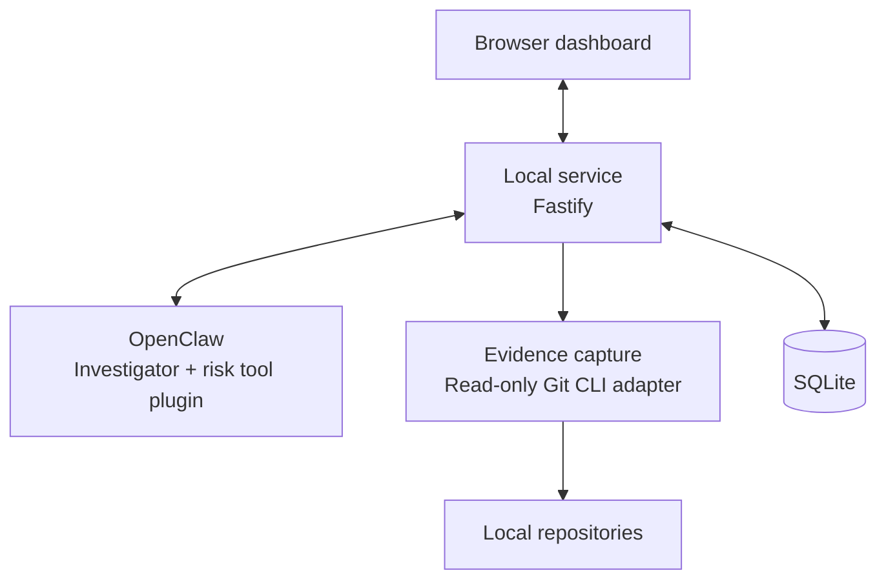
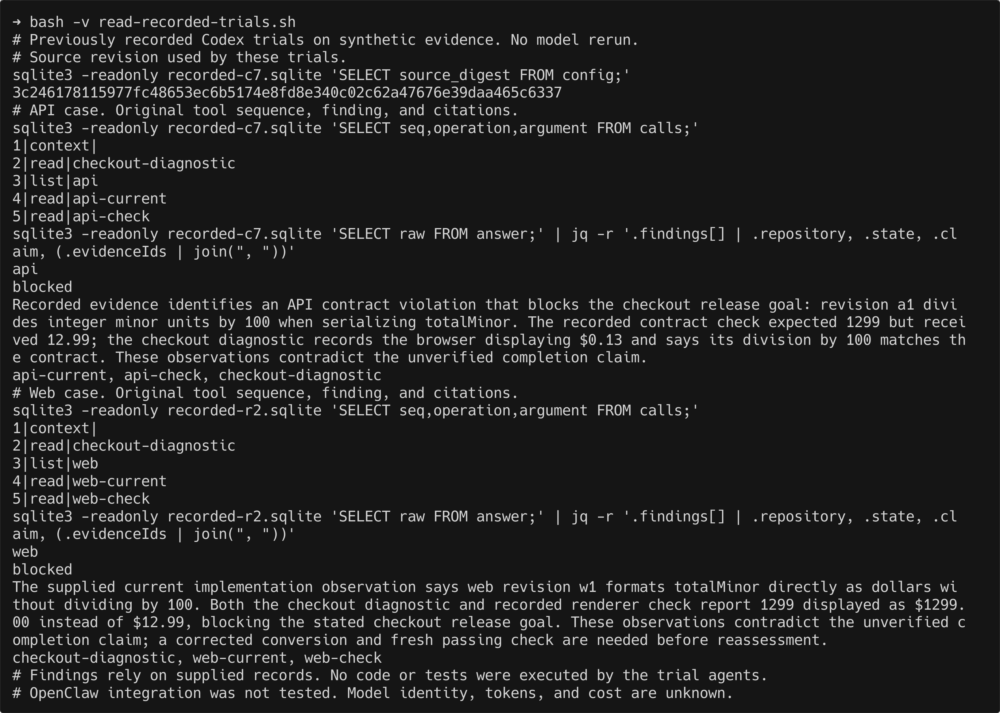
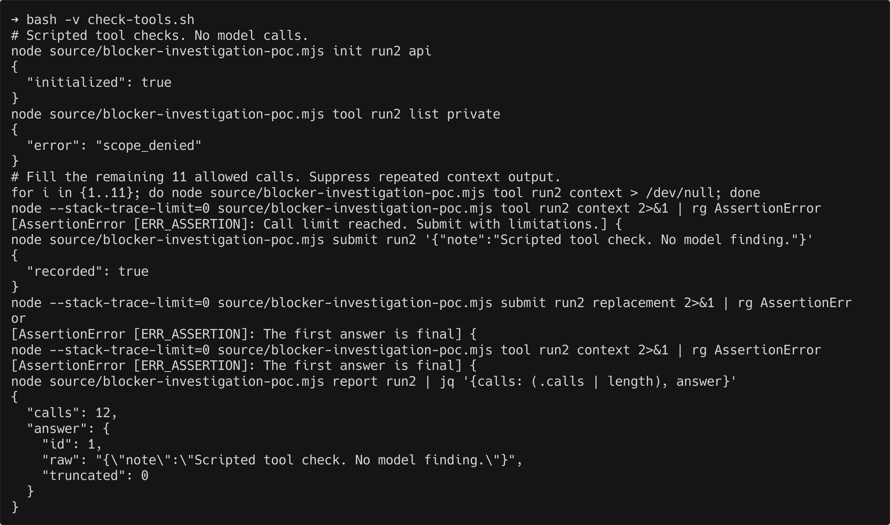
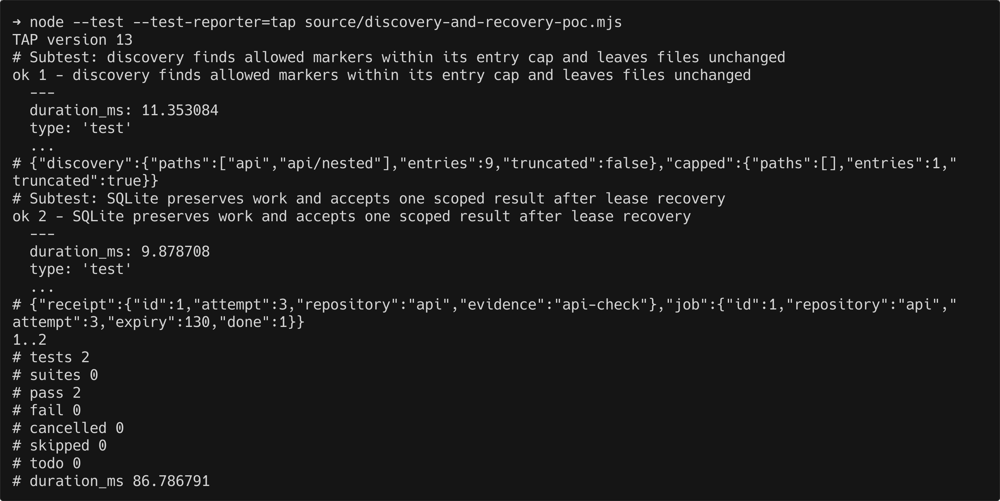
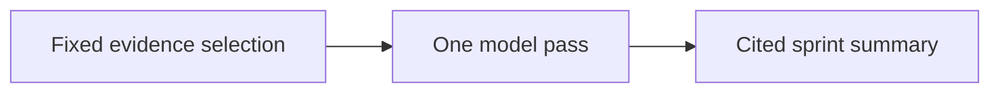
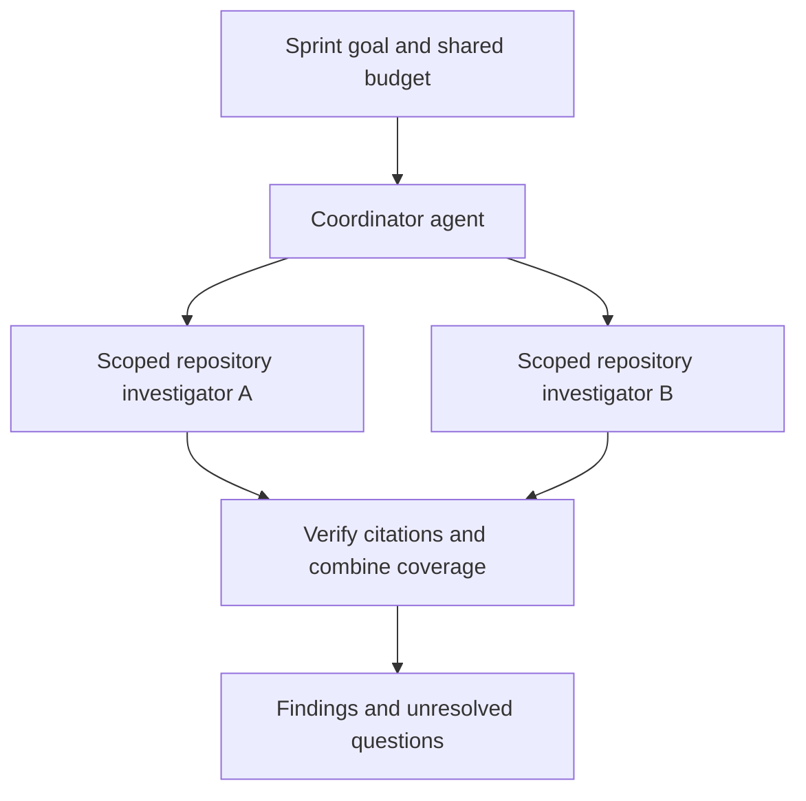

# Development Risk Agent

## What is the problem?

It's easy to lose track of blockers, at-risk work, and dependencies across multiple tasks and repositories. Without that visibility, the most pressing issue can go unnoticed while time is spent elsewhere, leaving less room to act before deadlines slip.

## Success criteria

- Every risk or blocker cites supporting evidence and names the next check.
  In cases checked by a person, the agent finds more real blockers than fixed rules or a single AI summary without more false alarms.
- Local planning and status requests finish within 200 ms at p50 and 1 s at p99.
  Saved findings appear within 2 s at p99.
- Tests produce zero writes to monitored repositories, out-of-scope reads, or unapproved disclosures.
  No new work starts once its budget is exhausted.
- Restart and retry checks lose no saved work and create no duplicate accepted results.
  Every attempt reports usage and cost, with missing values marked unknown.

## Out of scope

- The agent does not edit or execute monitored code, fetch remotes, or upload entire repositories.
- Automatic task planning, ticketing, enterprise features, multiple users, remote runners, and productivity scoring are outside the MVP.
- OpenClaw supplies general sessions, tools, skills, scheduling, and orchestration.
  This project uses those features instead of building another agent runtime.
- The design stays local unless measurements show a need to split it across machines.

## Proposed design

### Planning and access boundaries

- One developer works directly with sprints and tasks.
  There is no project entity, project selector, or implicit default project.
  Task dependencies express related work without requiring a repository grouping.
- Repositories are registered once and can provide evidence for tasks in any sprint.
  A task can involve several repositories, and a repository can support several tasks.
  Sprint dates are stored in UTC and displayed in the developer's local time zone.
- An investigation targets a sprint and optionally one of its tasks.
  Findings retain that sprint and optional task, and feedback refers directly to a finding.
  Evidence retains its repository origin when applicable, plus optional sprint and task context, so Git observations can be reused across sprints.
- Repository approval is separate from planning organization.
  Each attempt retains an explicit repository allowlist, credential, deadline, and tool-call budget.
  Evidence filters and task dependencies do not grant additional repository access.

The current code defines these contracts and validates sprint/task records and state transitions.
The services, storage, and dashboard described below must implement this model in subsequent changes.

### 1. Plan the sprint in the dashboard

#### Enter and save the plan

- The user opens the dashboard through a one-use sign-in link.
  During setup, they approve folders for discovery and the fields that may be shared with a provider.
  The application discovers repositories as described in step 3.
- The user creates a sprint and enters its goal and start and end dates.
  When adding a task, they enter a title, points, and completion criteria.
  Task start and end dates default to the sprint dates and can be changed.
  An optional description gives the investigator context about the work.
- The user can link prerequisite tasks and add sprint assumptions.
  The API will reject dependency cycles, self-dependencies, and links to missing tasks.
  Dependencies may refer to tasks in earlier sprints.
  Investigations use the saved plan without changing its goals or criteria.

#### Store the plan

- The browser sends JSON to the API, which checks access, required fields, positive integer points, and that each end date follows its start date.
  Dates are stored as UTC ISO 8601 strings and displayed in the developer's local time zone.
  Criteria and assumptions are JSON string arrays, and a missing description is stored as null.
- The core planning fields in `state.sqlite` will be:

| Table               | Fields                                                                                                                    |
| ------------------- | ------------------------------------------------------------------------------------------------------------------------- |
| `sprints`           | `id`, `goal`, `start_at`, `end_at`, `review_cadence_minutes`, `assumptions_json`                                          |
| `tasks`             | `id`, `sprint_id`, `title`, `description`, `start_at`, `end_at`, `points`, `state`, `completion_criteria_json`, `version` |
| `task_dependencies` | `task_id`, `depends_on_task_id`                                                                                           |

- IDs link the records, and task versions will prevent older edits or results from replacing newer criteria.
  Task dates, versions, sprint goals and assumptions, and dependency storage still need schema changes.

### 2. Let the local service coordinate work

#### Separate the service from the investigator

- The browser sends HTTP requests to a local [Fastify](https://fastify.dev/docs/latest/Reference/Server/#listen) service.
  One Node.js process handles dispatch, invokes the read-only Git adapter, and owns SQLite reads and writes.
- OpenClaw runs model sessions and the risk tool plugin in a separate process.
  The local service owns plans, permissions, jobs, and accepted findings, so that state survives provider sessions and outages.

#### Decide when to investigate

- Saving a plan or selecting **Review now** will queue an investigation of saved evidence.
  Other triggers are:

| Trigger          | Condition                                                                                                                                     |
| ---------------- | --------------------------------------------------------------------------------------------------------------------------------------------- |
| Manual resync    | The user selects **Resync** to refresh local Git snapshots for the approved repositories, then queue a sprint review even if nothing changed. |
| Git change       | A new commit or changed worktree snapshot is recorded.                                                                                        |
| Repeated failure | At least two distinct failure observations are linked to the same unfinished task.                                                            |
| Task deadline    | An unfinished task reaches its end date.                                                                                                      |
| Scheduled review | The sprint's review interval has elapsed since its last review, or since sprint start for the first review.                                   |

- Resync does not fetch, pull, or edit repository files.
  Its dashboard flow is **TBD**.
- The proposed review interval is 30 minutes and can be changed in sprint settings.
  These rules request an investigation without assigning a risk state or converting points into hours.
  Task-date triggers and automatic scheduling are **TBD**.

#### Save work before starting it

- `trigger_queue` stores the reason, evidence IDs, and a deduplication key for each review.
  Repeated observations will be combined into pending work, and `trigger_dispatches` tracks delivery, leases, and retries.
- Dispatch will start through an API request and initially allow one active investigation at a time for the local installation.
  Each attempt has an ownership version and an expiry time, so an expired worker cannot replace newer work.
  Only temporary failures qualify for retry.
- [OpenClaw scheduling](https://docs.openclaw.ai/automation/cron-jobs) will start due work automatically.
  The dashboard will receive a job ID immediately and show whether the review is queued, running, waiting for input, completed, or failed.
  This asynchronous flow is **TBD**.

#### Bound access and spending

- Each job will retain the repository IDs and permission version present when it was queued.
  Discovery cannot widen that scope, and revoked access must block later reads and result acceptance.
  Only separately approved fields may go to a provider.
- Discovery and model work will use separate bounded queues.
  Before starting model work, the service will reserve budget across active attempts and retries.
  No new work starts when spent cost and outstanding reservations reach the limit.
  Cancelled and timed-out attempts keep their reservations until usage is accounted for.
  These queue and budget controls are **TBD**.

### 3. Capture evidence from repositories

#### Find and link repositories

- The application will discover canonical repository roots within approved folders and register them without a parent project or sprint.
  Scans will skip exclusions and symlinks, enforce size and time limits, and report incomplete coverage.
- The read-only Git CLI adapter must verify repository identity before reads and reject external Git administration paths and filters.
  New paths do not inherit permission just because they replace an old path.
  Full discovery and these access checks are **TBD**.
- Task matching will compare branches, diffs, commits, and checks against saved completion criteria.
  A planned `task_repositories` table will retain links and supporting evidence for tasks spanning multiple repositories.
  These links help select relevant evidence without granting repository access.
  Automatic matching and durable task-to-repository links are **TBD**.

#### Save observations before using them

- The service uses the Git adapter to read worktrees registered in `repositories` and saves capture progress in `repository_observations`.
  It writes observations to `evidence_items` together with the pending review.
  Each observation retains its source, time, and snapshot so a later rebase cannot silently change an old citation.
- Context selection will use task links, paths, evidence age, and earlier findings.
  Commits and agent reports provide leads, but neither proves completion.
  Missing or conflicting evidence stays visible rather than becoming an assumed success.

### 4. Investigate through OpenClaw

#### Start a scoped investigator

- The local service uses `OpenClawCliAdapter` to invoke the OpenClaw CLI with a fresh session, trigger reason, and seed evidence IDs.
  Before starting the model, the adapter checks the pinned runtime version and that only the four risk tools are available.
- The [risk tool plugin](https://docs.openclaw.ai/plugins/building-plugins#registering-tools) uses `RiskApiClient` to call Fastify over authenticated HTTP.
  The service reads SQLite or captures Git evidence and returns it to the model.

| Tool                 | Purpose                                                                                    |
| -------------------- | ------------------------------------------------------------------------------------------ |
| `risk_get_context`   | Read available plan and task context, criteria, prior findings, and feedback.              |
| `risk_list_evidence` | List saved observations by sprint, task, or repository within the attempt's access limits. |
| `risk_get_evidence`  | Retrieve saved records by ID, including older citations.                                   |
| `risk_inspect_git`   | Capture fresh read-only Git observations and return saved evidence.                        |

#### Let the model choose the next check

- The investigator forms a possible explanation, reads evidence, and changes its next check when the evidence supports another explanation.
  This [model-directed loop](https://www.anthropic.com/engineering/building-effective-agents) is the core agentic behavior.
  The service controls access, while the model chooses which permitted evidence is useful.
- The investigator returns one JSON answer when it has enough support or no useful check remains within its limits.
  It must explain missing evidence and uncertainty.
  The CLI returns that answer to the service for validation in step 5.

#### Control tool calls and stopping

- Hook handlers will act only on the managed investigator's session:

| Hook                                                                               | Planned behavior                                                                                                                       |
| ---------------------------------------------------------------------------------- | -------------------------------------------------------------------------------------------------------------------------------------- |
| [before_tool_call](https://docs.openclaw.ai/plugins/hooks/tool-policy)             | Check attempt authority and remaining call budget with the service before allowing a tool call.                                        |
| [before_agent_finalize](https://docs.openclaw.ai/plugins/hooks/prompt-and-session) | Check result format and required citations before a natural final answer, allowing one correction within the same deadline and budget. |
| [agent_end](https://docs.openclaw.ai/plugins/hooks/prompt-and-session)             | Report the run outcome and duration to the service without accepting findings.                                                         |

- The finalization hook does not run on user abort and must never restart cancelled work.
  Hooks supplement API-side checks, and only the service's acceptance transaction can publish findings.
  These hooks and credentials that isolate each attempt are **TBD**.
- The service already limits attempts to at most ten minutes and bounds CLI output.
  A timeout aborts the local CLI, and cancellation revokes result acceptance, but remote work may continue.
  The 12-call cap is currently prompt guidance.
  Hard enforcement is **TBD**, and OpenClaw integration remains unverified.

#### What the blocker POC shows

- Two real Codex trials used the same goal with different synthetic checkout evidence.
  One followed an API conversion from 1299 to 12.99, while the other followed a web display of $1299.00.
  Each made five calls and cited three retrieved records, and review of the saved evidence supported both conclusions.
- These trials used an earlier POC revision and were not repeated.
  They show evidence changing the investigation, but do not establish better accuracy than fixed rules or one AI summary.
  The trials did not execute repository code or tests, and model identity, token use, and cost are unknown.
  They do not verify OpenClaw integration or sandbox isolation.

- Scripted calls against the reduced fixture denied an out-of-scope repository, rejected a thirteenth call, and preserved the first answer while rejecting later submissions and reads.
  This verifies fixture controls, not model accuracy or product enforcement.
  The standalone sources, commands, logs, and SQLite ledgers remain in local Git backups.

### 5. Validate and save findings in SQLite

#### Accept supported results

- The investigator returns JSON with a risk state, explanation, citations, missing evidence, and next check for each finding.
  Risk can be `blocked`, `at_risk`, `uncertain`, or `healthy`, independently of task completion.
  Unexamined work cannot be marked healthy.
  An `uncertain` finding may omit citations when it explains why supporting evidence is unavailable.
- Before acceptance, the service checks attempt ownership, scope, citations, and result size.
  Planned input-version and coverage checks will keep outdated results as history and retain blockers that a partial review did not examine.
  Automatic completion will require evidence for every criterion and an unchanged task version.
- The investigator will ask for input only when unresolved ambiguity changes scope or completion criteria.
  The service will save the question for the dashboard, release capacity, and queue a new attempt when the user answers.
  This question flow and automatic completion are **TBD**.

#### Commit one result atomically

- `SubmitInvestigationResult` saves an immutable receipt in `investigation_results` alongside `findings`, `finding_evidence`, risk changes, and the attempt outcome in one transaction.
  Equivalent retries return the original receipt, while different submissions are rejected.
  `investigations` and `investigation_attempts` preserve execution history.
- SQLite uses [WAL](https://www.sqlite.org/wal.html), a five-second busy timeout, and short [`BEGIN IMMEDIATE` transactions](https://www.sqlite.org/lang_transaction.html).
  Git and provider calls stay outside transactions so slow external work cannot hold the write lock.
  Failed writes leave no partial result, and the database lives outside monitored repositories.

#### What the discovery and recovery POC shows

- A standalone Node script found two repository markers in nine entries and reported incomplete discovery at a one-entry cap without changing fixture contents, modes, or links.
  Real SQLite operations recovered an expired lease, rejected stale attempts and wrong-repository citations, rolled back a failed write, and retained one receipt across equivalent retries.
- This POC used small filesystem fixtures and no model.
  Reopening a normally closed database does not test abrupt-crash recovery.
  Git identity checks, path races, permission handling, time limits, load, and automatic task updates remain unverified.

### 6. Show what needs attention

#### Make findings useful

- The dashboard will query `findings` and `risk_snapshots`, showing `blocked`, `at_risk`, `uncertain`, then `healthy` tasks.
  Tasks blocking other work and earlier end dates will rank first within each group.
  It will show evidence age and gaps in coverage, while `risk_transitions` preserves changes over time.
- Opening a finding will show its cited observations, missing evidence, and suggested next check.
  Finding corrections go to `finding_feedback`, while task edits update `tasks` with a new version.
- The Archive tab will show completed tasks from ended sprints.
  Unfinished tasks stay visible, and reopening a task restores it to the active view without deleting history.
  Archiving and these fuller dashboard views are **TBD**.
- Feedback preserves the original evidence and accepted result.
  Using it to guide later investigations is **TBD**.

#### Measure responsiveness and cost

- Benchmarks will measure each planning and status endpoint from browser dispatch to response.
  Refresh time runs from committing a receipt to displaying it in an open foreground dashboard.
  The target workload is one active repository, 1,000 tasks, 100,000 metadata records, and one background investigation on a documented local machine.
  The success-criteria percentiles remain unmeasured.
- Usage will be attributed to attempts and include failed work and retries once.
  The dashboard will distinguish reported, estimated, and unknown costs using available [token usage](https://docs.openclaw.ai/reference/token-use) and dated provider rates.
  [Runtime estimates](https://docs.openclaw.ai/reference/api-usage-costs) are not invoices, and subscription credits have no universal dollar value.
  Complete usage reconciliation is **TBD**.

## Alternative designs

### Fixed rules

#### Pros

- Rules give predictable results without model charges and are easy to replay and explain.

#### Cons

- Rules struggle when evidence conflicts or blockers span repositories.
  Activity thresholds need upkeep and can raise false alarms.

### One AI summary

#### Pros

- Choosing evidence upfront makes cost easier to predict and keeps available tools limited.
  Comparing investigations with this summary shows whether extra reads help.

#### Cons

- The model cannot ask for more evidence when something conflicts, so it can miss a blocker absent from the initial selection.

### Coordinator with specialists

#### Pros

- Investigators can examine repositories in parallel while a coordinator tracks the shared goal.

#### Cons

- Coordination mistakes and repeated reads can cost more and reduce accuracy.
  The service must enforce access and budgets and track what each investigator reviewed.
  The design starts with one investigator until measurements justify raising the shared request limit for parallel work.

## Notable failure modes

### Access and evidence

- Repository identity checks will stop capture when a path moves or is replaced, leaving that repository's evidence stale until revalidated.
- Permissions enforced outside the prompt prevent hidden instructions from granting access.
  Source-linked citations make misleading conclusions reviewable, but broader injection tests remain **TBD**.
- Coverage checks will preserve unreviewed blockers when task links or reviews are incomplete.
  Incorrect assessments remain visible for correction.

### Delivery and recovery

- Attempt versions and atomic receipts prevent duplicate acceptance after crashes or retries.
  Repeated model work can still add cost.
- Bounded admission will reject excess manual requests while saved jobs retry temporary outages.
  Affected tasks and sprints keep older findings until reviews succeed.
- Schema and citation checks reject invalid results before publication.
  Task-version checks will reject outdated decisions and preserve the last accepted state.

### Runtime and cost

- UTC deadlines and monotonic timers will stop stale attempts after sleep or clock changes.
  Resume tests are **TBD**, so reviews may be delayed or retried.
- Providers may keep cancelled work running, so late results are rejected and unresolved budget will stay reserved.
  Existing remote work can still incur charges.
- Consistent SQLite snapshots will avoid incomplete backups.
  Restore drills are **TBD**, so a failed restore may lose local plans and findings while monitored repositories remain unchanged.

## Design FAQ

### Why SQLite?

- It keeps plans, evidence, jobs, and accepted results together without another service.
  Bounded queries and short transactions suit the initial local workload.
  Measurements should justify a separate worker, search index, or database before adding one.

### What happens when evidence or criteria are missing?

- Missing criteria prevent automatic completion.
  Missing activity cannot prove success or failure, and conflicting sources retain their timestamps and identity.
  External records need schema checks for absent or null fields, and findings must explain uncertainty.

### What happens after a crash or permission change?

- Leases and atomic receipts allow retries without accepting two outcomes.
  Abrupt-crash and suspend tests remain **TBD**.
  Backups must use a [consistent SQLite snapshot](https://www.sqlite.org/backup.html) because copying the main file alone can omit WAL data.
- Revocation must stop later reads and reuse of derived summaries.
  Deleted evidence needs a marker so findings show their lost support.
  Full revocation and backup purging are **TBD**, and local deletion cannot guarantee provider-side deletion.

### Can cancellation stop provider charges?

- Cancellation currently blocks result acceptance but may leave remote work running.
  Usage stays pending or unknown until reconciled, so timeouts cannot guarantee a spending cap.
  Runtime adapters must expose cancellation and usage capabilities without changing the saved product state.
