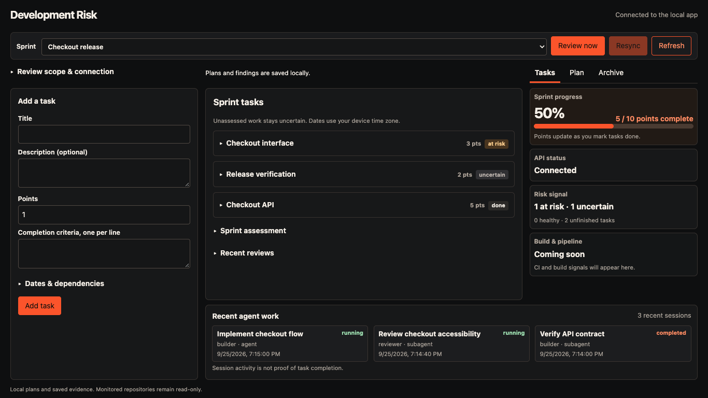
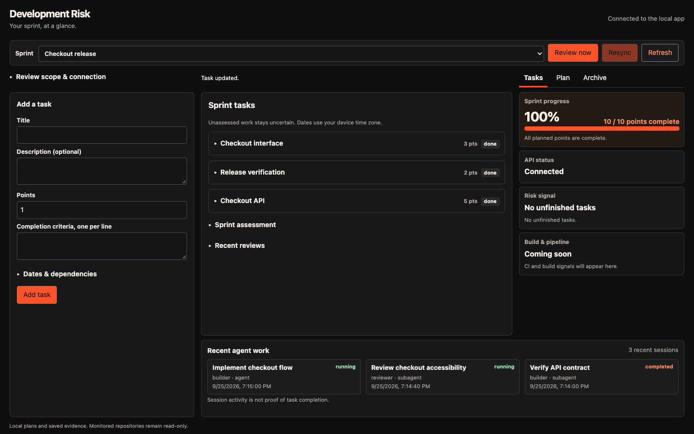
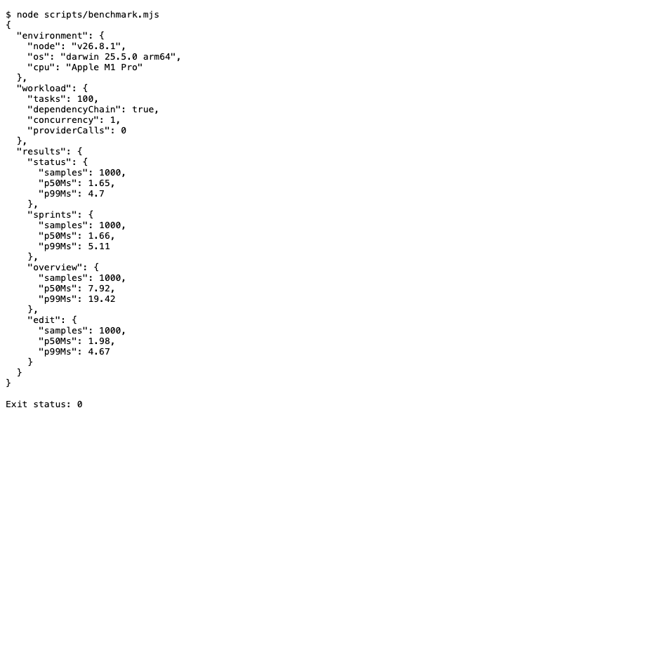
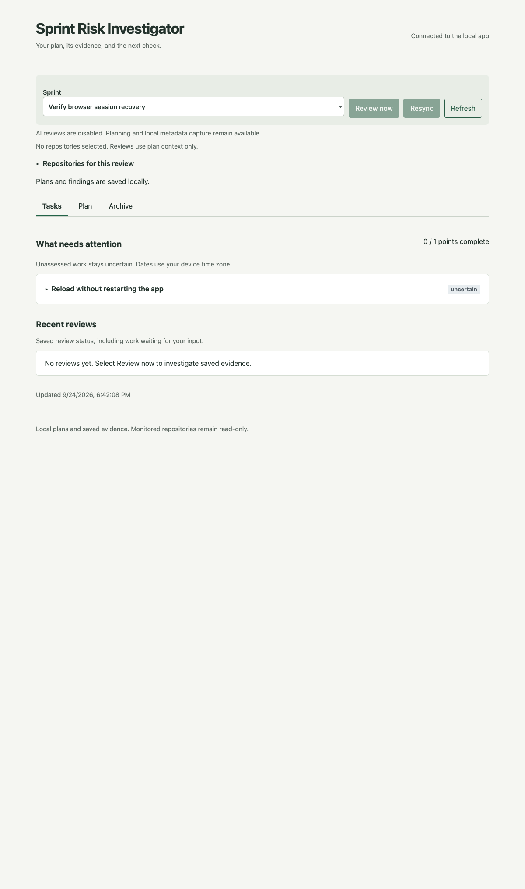

# Local verification

## V2 dashboard — September 25, 2026

The built application was exercised in Chrome against temporary SQLite state and two synthetic
Git repositories, with a scripted review provider and mock agent sessions. Checks covered:

- Sprint/task creation and editing, dependencies, validation, completion, reopening, and archive rollover.
- Repository discovery, explicit scope, metadata capture/resync, evidence viewing, review answers, feedback, and cancellation.
- Points changing from 0% to 50% to 100%, and completed points surviving sprint archival.
- Draft preservation during polling, session reload, persisted state after restart, and fresh sign-in.
- Agent disconnect/recovery without disabling planning; running/completed session metadata remains separate from task completion.
- No page overflow at 1280×720, 1366×768, 1440×900, or 1920×1080. Expanded details/long lists scroll inside panels; 390×844 uses a stacked layout without horizontal overflow.

Separately, an isolated **OpenClaw 2026.7.1-2 Gateway** created a parent session and a child session
with `runStarted: false`. The production activity adapter discovered both with the correct roles
and idle status through the real CLI. Running/completed/error states were exercised with synthetic
responses; this pass made no model calls. The browser console had no application errors.

`pnpm check` passed **53 test files / 819 tests**; `pnpm build` passed.
The fixtures, browser profile, processes, and temporary state were removed afterward.

## HTTP latency

Run `pnpm benchmark` to build the app and measure real loopback HTTP requests against a temporary SQLite database.
The workload contains one sprint and 100 tasks in a dependency chain, with 20 warmups and 1,000 sequential measured requests per operation.
It includes authentication, HTTP transfer, and JSON parsing; task edits commit a new version.
The command removes its temporary state and never loads a provider or reads a monitored repository.

On an Apple M1 Pro, macOS Darwin 25.5.0, Node.js 26.8.1 (September 24, 2026):

| Operation       | p50     | p99      |
| --------------- | ------- | -------- |
| Status          | 1.65 ms | 4.70 ms  |
| List sprints    | 1.66 ms | 5.11 ms  |
| Sprint overview | 7.92 ms | 19.42 ms |
| Edit task       | 1.98 ms | 4.67 ms  |

These observations meet the design's 200 ms p50 / 1 s p99 planning and status targets for this fixture.
They do not measure cold startup, concurrent users, large evidence histories, model latency, or browser rendering, and are not a production latency guarantee.
Timing is reported rather than asserted in CI because machine load changes the results.

## Browser access

A real browser exercised the compiled dashboard with a saved task: reload retained the session, an expired credential in tab storage locked the page, and a fresh `pnpm dashboard` link reopened it with the task intact. The application process stayed running throughout, and the browser console reported no errors.
The browser exercise simulated expiry by changing tab storage. Separate authenticated HTTP tests advance the server clock to check session expiry, one-use link rejection, and the restriction that only the local owner credential can mint a new link.

## Crash, restore, and clock-gap recovery

Real child-process tests terminate SQLite writers with `SIGKILL`: committed WAL data survives reopening, incomplete task and evidence writes roll back, and an accepted receipt and completed dispatch survive without another call to the scripted runtime.
Recovery tests retain an orphaned attempt until its lease expires, then reject stale credentials and results while preserving unresolved token reservations.

The snapshot CLI uses SQLite's backup API, verifies the resulting database, and restores plans and evidence through the application stores. Tests cover committed WAL data, corrupt or unsafe files, existing destinations, and source or destination paths inside registered repositories, including a directory alias. A rejected source inside a monitored repository creates no SQLite sidecars.
See the [backup and restore steps](local-use.md#back-up-and-restore-state) before restoring; snapshots retain pending work and leases, and do not revoke remote attempts.

A stalled runtime test advances the injected wall clock beyond the persisted attempt deadline while its relative timer remains pending. The local deadline poll releases the wait and allows scheduler recovery; backward or invalid clocks do not extend the original relative timeout, and completion clears both timers.
This models a clock gap without suspending the operating system. These drills establish the tested process-crash and recovery behavior, not durability under power loss or proof that a remote provider stopped work.

## Real provider reviews

The [live evaluation](evaluation.md) records three synthetic cases run through the built application, native OpenClaw Gateway, and configured model. It includes accepted findings, scoped reads, reported usage, and explicit limits on the conclusions; ordinary tests and CI never run those provider calls.
